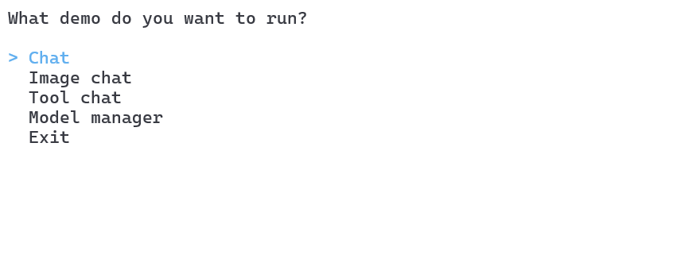

> [!NOTE]
> This demo project made its way back to the [OllamaSharp](https://github.com/awaescher/OllamaSharp) repository.

 

# OllamaSharpConsole

This repository contains the main demo application and code samples for [OllamaSharp](https://github.com/awaescher/OllamaSharp).

## Ollama API

This demo application uses the Ollama API and can be run to interact with Ollama on your local or a remote machine.

It covers every Ollama API endpoint including chats, embeddings, listing models, pulling and creating new models, and more.

